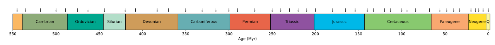
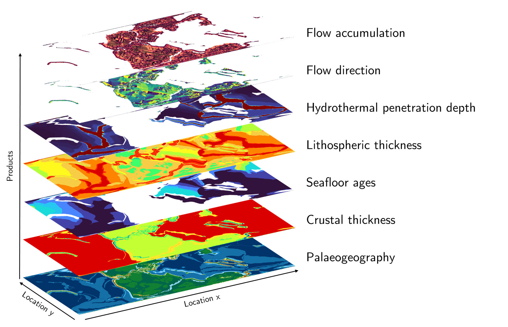

Introduction
============

Welcome to the `Palaeo Data Cube (PDC) <https://github.com/florianfranz/palaeo-data-cube>`_ user manual.

This page gives some basic information about the PDC and what challenges we aim to solve through it.

What is the PDC ?
------------------
The PDC is a framework for sharing maps of the Earth in deep-time. It is inspired by the present-day Earth observations
(EO) Data Cubes and the Digital Earth vision. The PDC provides access to global maps depicting various aspects of the
Earth over the Phanerozoic (last 545 million years in 45 steps), derived from the PANALESIS plate tectonic model.

Layers are available for:

1. Palaeogeography: Topographic maps with sea-level corrections, calculated based on the global oceanic basin size (assuming constant oceanic volume through time). Our reconstructions do not have flat seafloor.
2. Crustal thickness
3. Seafloor ages
4. Lithospheric thickness
5. Maximum hydrothermal penetration depth
6. Flow direction
7. Flow accumulation

Maps are available for every reconstruction mentioned above, share the same projection, resolution and extent.
The specifications are the following:

Equal area projection (recommended for area or volume calculations)
~~~~~~~~~~~~~~~~~~~~~~~~~~~~~~~~~~~~~~~~~~~~~~~~~~~~~~~~~~~~~~~~~~~~

.. list-table::
   :header-rows: 1

   * - Property
     - Value
   * - Projection
     - `ESRI:54034 <https://epsg.io/54034>`_
   * - Resolution
     - 10 × 10 km
   * - Extent
     - -20037508.34 -6363885.33, 20037508.34, 6363885.33

Latitude/Longitude
~~~~~~~~~~~~~~~~~~

.. list-table::
   :header-rows: 1

   * - Property
     - Value
   * - Projection
     - `EPSG:4326 <https://epsg.io/4326>`_
   * - Resolution
     - 0.1 × 0.1 km
   * - Extent
     - -180 -90, 180, 90

Architecture
------------

The PDC is based on open source solutions for serving, describing, searching and archiving the data products. They are the following:

.. list-table::
   :widths: 30 20 50
   :header-rows: 1

   * - Component
     - Technology
     - Purpose
   * - **Data Server**
     - GeoServer
     - Serves geospatial data via OGC web map services (WMS)
   * - **Metadata Catalog (static)**
     - GeoNetwork
     - Stores and publishes ISO/INSPIRE metadata records
   * - **Metadata Catalog (dynamic)**
     - STAC
     - Provides dynamic, API-based metadata for spatiotemporal assets
   * - **STAC Browser**
     - In development
     - Web-based interface for browsing and searching STAC catalog
   * - **Data Archive**
     - Zenodo
     - Long-term storage, DOI assignment, version management