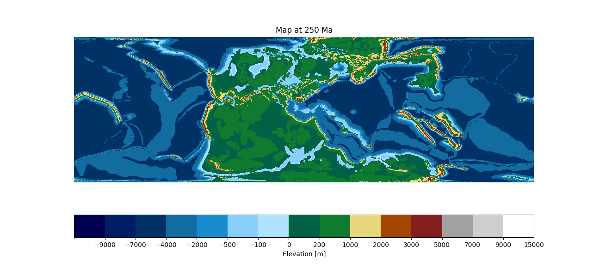

Usage
======

Discovering available time steps
--------------------------------

Before requesting raster data via WCS, it is often useful to know which temporal
slices are available for a given layer. GeoServer exposes this information
through the WCS ``DescribeCoverage`` operation.

The following example queries the service and returns the list of available
geological ages (in millions of years, Ma) for a raster layer.

.. code-block:: python

   import requests
   import xml.etree.ElementTree as ET

   def get_available_ages(workspace, layer_name):
       url = (
           f"https://geoserver.panalesis.org/geoserver/{workspace}/wcs?"
           "service=WCS&version=2.0.1&request=DescribeCoverage&"
           f"coverageId={workspace}__{layer_name}"
       )

       root = ET.fromstring(requests.get(url).content)
       ns = {"gml": "http://www.opengis.net/gml/3.2"}

       years = [
           int(tp.text.split("-")[0])
           for tp in root.findall(".//gml:timePosition", ns)
       ]

       return sorted(year - 2000 for year in years)

The function can be called by providing a workspace and layer name:

.. code-block:: python

   ages = get_available_ages(
       workspace="panalesis_atlas",
       layer_name="palaeogeography",
   )

   print("Available ages:", ages)
   print("Number of reconstructions:", len(ages))

Example output:

.. code-block:: text

   Available ages: [0, 6, 11, 15, 20, 33, 40, 48, 56, 68, 84, 94, 100, 113, 120,
                    133, 140, 154, 165, 180, 200, 210, 220, 230, 240, 250, 270,
                    290, 300, 315, 331, 350, 370, 383, 393, 408, 420, 444, 463,
                    475, 489, 500, 518, 535, 545]

   Number of reconstructions: 45

Each value corresponds to a valid time step that can be used in subsequent WCS
``GetCoverage`` requests.

Loading raster data via WCS
----------------------------

This example shows how to retrieve raster data from a Web Coverage Service (WCS)
and display it using Python. Users only need to specify the GeoServer workspace,
the layer name, and the geological age.

The WCS request returns a GeoTIFF, which is read and visualized using
``rasterio`` and ``matplotlib``.

**Example**

.. code-block:: python

   import requests
   import tempfile
   import rasterio
   import matplotlib.pyplot as plt
   import matplotlib.colors as mcolors
   import numpy as np

   # ---- User parameters ----
   workspace = "panalesis_atlas"
   layer_name = "palaeogeography"
   age_ma = 250

   # ---- GeoServer-style interval colormap ----
   colormap_intervals = [
       (-9000, "#000050"),
       (-7000, "#001e64"),
       (-4000, "#003266"),
       (-2000, "#136ca0"),
       (-500,  "#188ccd"),
       (-100,  "#87cefa"),
       (0,     "#b0e2ff"),
       (200,   "#006147"),
       (1000,  "#107b30"),
       (2000,  "#e8d67d"),
       (3000,  "#a34400"),
       (5000,  "#821e1e"),
       (7000,  "#a1a1a1"),
       (9000,  "#cecece"),
       (15000, "#ffffff"),
   ]

   boundaries = [-11000] + [v for v, _ in colormap_intervals]
   colors = [c for _, c in colormap_intervals]

   cmap = mcolors.ListedColormap(colors)
   norm = mcolors.BoundaryNorm(boundaries, cmap.N)

   # ---- Build WCS request ----
   year = 2000 + age_ma
   time = f"{year:04d}-01-01T00:00:00.000Z"

   wcs_url = (
       f"https://geoserver.panalesis.org/geoserver/{workspace}/wcs?"
       "service=WCS&version=1.0.0&request=GetCoverage&"
       f"coverage={workspace}:{layer_name}&"
       "crs=EPSG:54034&"
       "bbox=-20037508.34,-6363885.33,20037508.34,6363885.33&"
       "width=4008&height=1273&"
       f"time={time}&format=GeoTIFF"
   )

   # ---- Fetch and display ----
   response = requests.get(wcs_url)
   response.raise_for_status()

   tmp = tempfile.NamedTemporaryFile(suffix=".tif", delete=False)
   tmp.write(response.content)
   tmp.close()

   with rasterio.open(tmp.name) as ds:
       data = ds.read(1)
       if ds.nodata is not None:
           data = np.ma.masked_equal(data, ds.nodata)
       plt.imshow(data, cmap=cmap, norm=norm, interpolation="nearest")
       cbar = plt.colorbar(
       plt.cm.ScalarMappable(norm=norm, cmap=cmap),
        ax=plt.gca(),
        label="Elevation [m]",
        boundaries=boundaries,
        ticks=boundaries[1:]  # skip the extra lower bound
    )
       plt.title(f"Map at {age_ma} Ma")
       plt.axis("off")
       plt.show()

This should yield something like this:

**Notes**

- ``workspace`` corresponds to the GeoServer workspace or data store
- ``layer_name`` is the published raster layer
- ``age_ma`` controls the temporal slice via the WCS ``time`` parameter
- The spatial extent and output resolution are fixed for simplicity