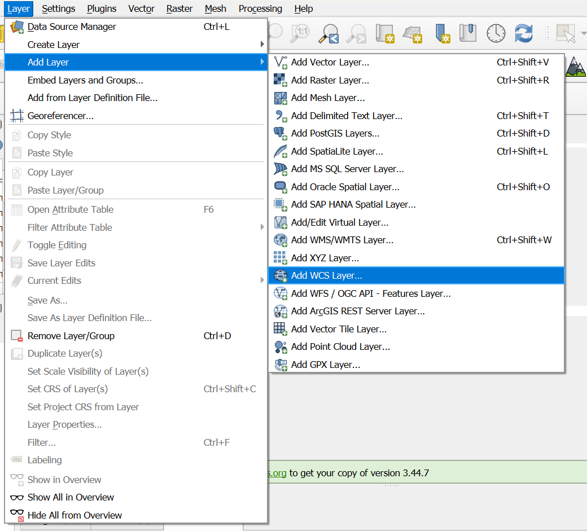
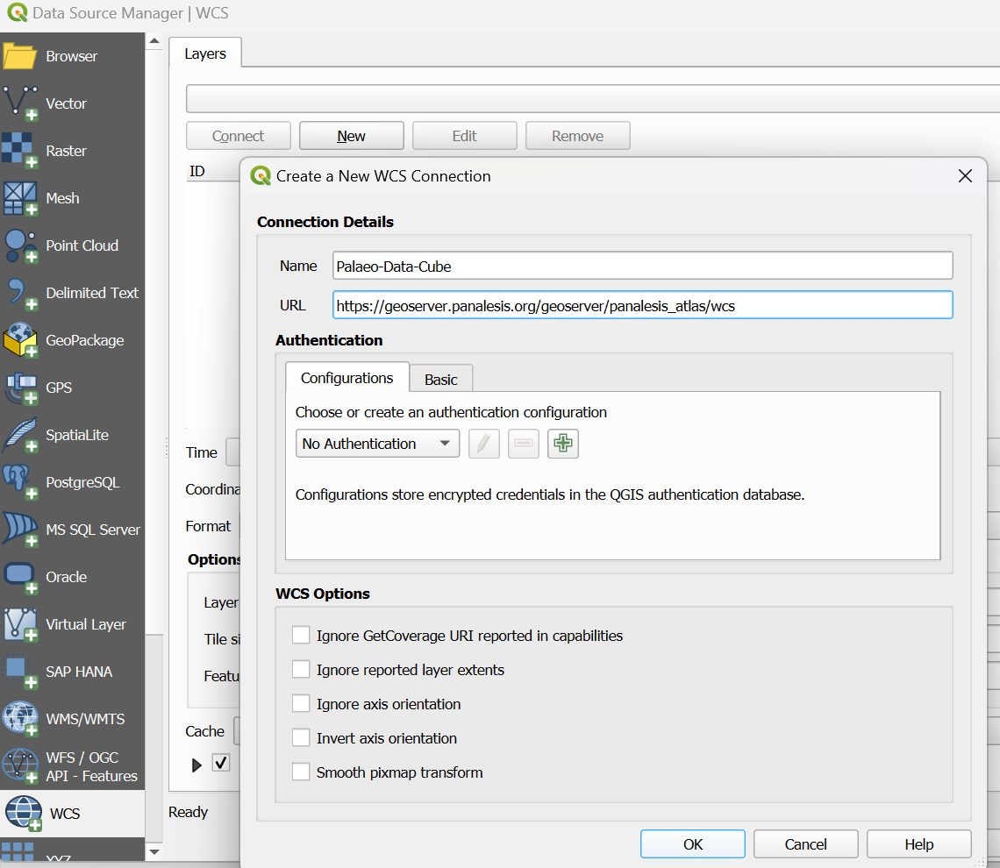
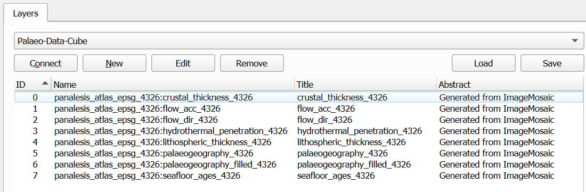
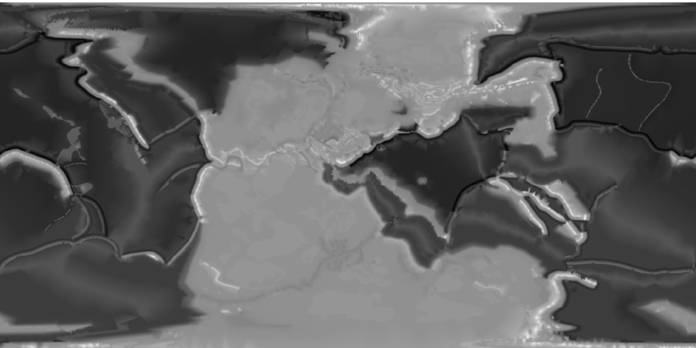
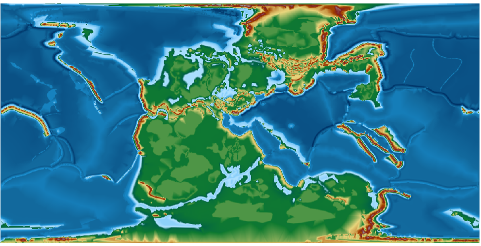
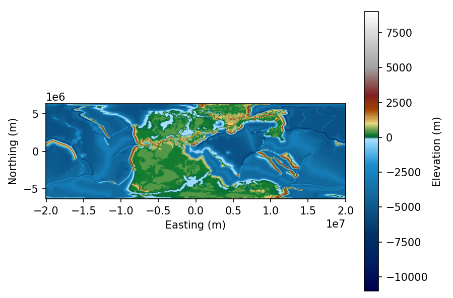

Usage
======

Load Data in QGIS
-------------------

The PDC layers are accessible in QGIS via the top menu. Click on "Layer/Add Layer/Add WCS Layer":

A new window should open. In the "Layers" tab, click on "New". This should open another window to create the new WCS connection.

Fill in the information: for the name, anything like "Palaeo Data Cube" is fine.
Depending on the layers you want,The URL should be :

- For equal area: https://geoserver.panalesis.org/geoserver/panalesis_atlas/wcs
- For lat/lon: https://geoserver.panalesis.org/geoserver/panalesis_atlas_epsg_4326/wcs

Click on "OK", and the on "Connect". All layers should be listed:

Clicking on one of the layers will allow you to select a time-step. The format follows the ISO 8601 format explained
before, with the geological age being embedded by adding 2000 to it, so 250 Ma would be '2250-01-01T00:00:00.000Z'. If
we select this timeslice, the map should look like:

If you want to apply a pre-defined style to this layer, some ``.qml`` files are available in the ``files/styles`` folder:

https://github.com/florianfranz/palaeo-data-cube/tree/main/files/styles

Apply the `palaeogeography` style by downloading it from the folder, then go to QGIS, double click on the layer, go to
the symbology window and on the bottom-left, click on ``Styles/Load Style`` and browse to select the file. Load it and
click `OK`. The style should be applied and your map should look like this:

Load Data in Python
-----------------------

Discovering available time steps
^^^^^^^^^^^^^^^^^^^^^^^^^^^^^^^^^^
Before requesting raster data via WCS, it is often useful to know which temporal
slices are available for a given layer. GeoServer exposes this information
through the WCS ``DescribeCoverage`` operation.

The following example queries the service and returns the list of available
geological ages (in millions of years, Ma) for a raster layer.

.. code-block:: python

   import requests
   from xml.etree import ElementTree as ET

    def get_available_ages(
            layer_name,
            base_url="https://geoserver.panalesis.org/geoserver/",
            workspace="panalesis_atlas",
            service_type="WCS",
            service_version="1.0.0"
    ):
        describe_url = (
            f"{base_url}{workspace}/{service_type.lower()}"
            f"?service={service_type}&version={service_version}"
            f"&request=DescribeCoverage&coverage={workspace}:{layer_name}"
        )
        response = requests.get(describe_url)
        root = ET.fromstring(response.content)

        years = sorted(set(
            int(el.text.split("-")[0])
            for el in root.iter()
            if el.tag.endswith('timePosition') and el.text
        ))
        geological_ages = [year - 2000 for year in years]

        return years, geological_ages

The function can be called by providing a layer name:

.. code-block:: python

   years, geological_ages = get_available_ages("palaeogeography")
   print(geological_ages)
   print(f"Number of reconstructions: {len(geological_ages)}")

Example output:

.. code-block:: text

   [0, 6, 11, 15, 20, 33, 40, 48, 56, 68, 84, 94, 100, 113, 120, 133, 140,
    154, 165, 180, 200, 210, 220, 230, 240, 250, 270, 290, 300, 315, 331,
    350, 370, 383, 393, 408, 420, 444, 463, 475, 489, 500, 518, 535, 545]

   Number of reconstructions: 45

Each value corresponds to a valid time step that can be used in subsequent WCS
``GetCoverage`` requests.

Loading raster data via WCS
^^^^^^^^^^^^^^^^^^^^^^^^^^^^^

This example shows how to retrieve raster data from a Web Coverage Service (WCS)
and display it using Python. Users only need to specify the layer name
and the geological age.

The WCS request returns a GeoTIFF, which is read and visualized using
``rasterio`` and ``matplotlib``.

**Example**

.. code-block:: python

   def construct_wcs_url(layer_name,
                      geological_age,
                      base_url="https://geoserver.panalesis.org/geoserver/",
                      workspace="panalesis_atlas",
                      service_type="WCS",
                      service_version="1.0.0",
                      request_type="GetCoverage",
                      crs="EPSG:54034",
                      bbox="-20037508.34,-6363885.33,20037508.34,6363885.33",
                      resx="10000",
                      resy="10000",
                      format="GEOTIFF"):

    time = f"{geological_age + 2000:04d}-01-01T00:00:00.000Z"

    url = (
        rf"{base_url}{workspace}/{service_type.lower()}?"
        rf"service={service_type}&"
        rf"version={service_version}&"
        rf"request={request_type}&"
        rf"coverage={workspace}:{layer_name}&"
        rf"crs={crs}&"
        rf"bbox={bbox}&"
        rf"resx={resx}&"
        rf"resy={resy}&"
        rf"time={time}&"
        rf"format={format}"
    )
    return url

This function can be called simply:

.. code-block:: python

    geological_age = 250
    layer_name = "palaeogeography"
    wcs_url = construct_wcs_url(layer_name,layer_name)
    print(wcs_url)

This should return a correct WCS URL like:

.. code-block:: text

    https://geoserver.panalesis.org/geoserver/panalesis_atlas/wcs?service=WCS&version=1.0.0&request=GetCoverage&coverage=panalesis_atlas:palaeogeography&crs=EPSG:54034&bbox=-20037508.34,-6363885.33,20037508.34,6363885.33&resx=10000&resy=10000&time=2250-01-01T00:00:00.000Z&format=GEOTIFF

You can now use this URL to load the data using  ``requests`` and ``rasterio``, then plot it with ``matplotlib``

.. code-block:: python

    from rasterio.io import MemoryFile
    import matplotlib.pyplot as plt
    import matplotlib.colors as mcolors
    import numpy as np

    colormap_entries = [
        (9000, "#ffffff", "9000"),
        (7000, "#cecece", "7000"),
        (5000, "#a1a1a1", "5000"),
        (3000, "#821e1e", "3000"),
        (2000, "#a34400", "2000"),
        (1000, "#e8d67d", "1000"),
        (200, "#107b30", "200"),
        (0, "#006147", "0"),
        (-100, "#b0e2ff", "-100"),
        (-500, "#87cefa", "-500"),
        (-2000, "#188ccd", "-2000"),
        (-4000, "#136ca0", "-4000"),
        (-7000, "#003266", "-7000"),
        (-9000, "#001e64", "-9000"),
        (-11000, "#000050", "-11000"),
    ]

    colormap_entries_sorted = sorted(
        colormap_entries,
        key=lambda x: x[0]
    )
    elevations = [e[0] for e in colormap_entries_sorted]
    colors = [e[1] for e in colormap_entries_sorted]

    vmin, vmax = elevations[0], elevations[-1]
    norm_values = [(e - vmin) / (vmax - vmin) for e in elevations]
    cmap = mcolors.LinearSegmentedColormap.from_list(
        "palaeogeography",
        list(zip(norm_values, colors))
    )
    norm = mcolors.Normalize(vmin=vmin, vmax=vmax)

    data = requests.get(wcs_url).content
    with MemoryFile(data) as memfile:
        with memfile.open() as dataset:
            raster = dataset.read(1).astype(float)

            nodata = dataset.nodata
            if nodata is not None:
                raster[raster == nodata] = np.nan

            bounds = dataset.bounds
            extent = [bounds.left, bounds.right, bounds.bottom, bounds.top]

            fig, ax = plt.subplots()
            img = ax.imshow(
                raster,
                cmap=cmap,
                norm=norm,
                extent=extent,
                origin="upper"
            )
            cbar = plt.colorbar(img, ax=ax)
            cbar.set_label("Elevation (m)")
            ax.set_xlabel("Easting (m)")
            ax.set_ylabel("Northing (m)")
            plt.show()

**Notes**

- ``workspace`` corresponds to the GeoServer workspace or data store
- ``layer_name`` is the published raster layer
- ``age_ma`` controls the temporal slice via the WCS ``time`` parameter
- The spatial extent and output resolution are fixed for simplicity

Further Usage
-------------------

We showed above the two main ways to load the data for QGIS and in Python. The purpose of this documentation is not to
provide step-by-step instructions on how to use some specific layers of the Palaeo Data Cube. You may however find a
full course that uses the Palaeo Data Cube at https://unige-cgeom.github.io/SPACE-GEOLOGY/. This open course provides an
exercise in three parts on how to access, process, combine, visualize and export layers using Jupyter Notebooks.

The exercise is part of the SPACE-GEOLOGY (SPACE stands for Spatial Predictions and Analysesin Complex Environments) -
Methods for multiscale Earth science modelling, in which we apply GIS tools to analyze the evolution of the Earth in
deep-time:

1. Reconstructing Earth’s Past – From a Snapshot to Deep Time
2. How Fast Was Earth’s Engine Running?
3. Palaeogeography Meets Palaeoclimatology

